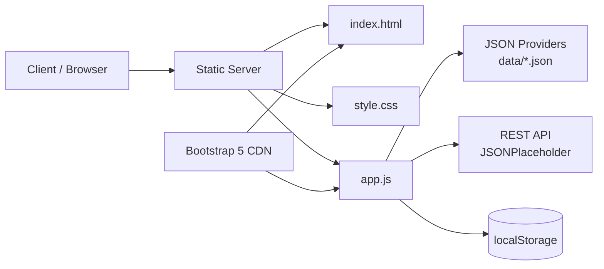

# Tugas Mandiri Minggu 02: Pengembangan Halaman Web Portofolio & Layanan Interaktif Accessible Berbasis HTML5 dan Modern CSS

Proyek ini merupakan pemenuhan Tugas Mandiri Minggu ke-2 untuk mata kuliah **Pemrograman dan Pengujian Aplikasi Web (12S3101)** di Program Studi S1 Sistem Informasi, Institut Teknologi Del. Halaman web ini dirancang sebagai *Single Page Showcase Webpage* yang modern, semantik, responsif, serta mematuhi standar aksesibilitas web (WCAG 2.2 Level AA).

---

## Identitas Pengembang
* **Nama:** Angga B. P. Sianipar
* **NIM:** 12S24032
* **Program Studi:** S1 Sistem Informasi
* **Institusi:** Institut Teknologi Del
* **Tahun Akademik:** Semester Genap 2025/2026

---

## Live Demo & Tautan Penting
* **Live Demo GitHub Pages:** https://AnggaSianipar.github.io/ppw-2026-week2-12S24032/
* **Repositori GitHub:** https://github.com/AnggaSianipar/ppw-2026-week2-12S24032

---

## Komparasi: Sebelum vs Sesudah Integrasi Framework

Tabel berikut menyajikan analisis perbandingan antara implementasi Vanilla HTML/CSS dengan setelah integrasi framework CSS:

| Indikator / Fitur | Sebelum Integrasi (Vanilla HTML/CSS) | Sesudah Integrasi Framework |
| :--- | :--- | :--- |
| **Arsitektur Kode & CSS** | Menulis stylesheet kustom manual dari nol di `style.css`. | Memanfaatkan utility classes / komponen pra-bina dari framework. |
| **Penyusunan Layout & Grid** | Menggunakan CSS Grid & Flexbox kustom via Media Queries `@media`. | Menggunakan sistem Grid/Flexbox bawaan framework yang dinamis. |
| **Formulir Interaktif** | Styling manual untuk `<fieldset>`, `<legend>`, dan kontrol input. | Menggunakan komponen form tersandar yang konsisten di semua browser. |
| **Efisiensi Waktu Muka** | Membutuhkan pengaturan detail margin, padding, dan transisi manual. | Waktu pengembangan visual layout lebih cepat dengan kelas bawaan. |
| **Aksesibilitas (a11y)** | Pengaturan atribut ARIA dan kontras warna dikelola penuh secara manual. | Beberapa komponen framework sudah membawa standar ARIA bawaan. |

### Bukti Pengujian Network DevTools

| Cold Load | Warm Load |
| :---: | :---: |
|  |  |

---

## Bukti Visual Komparasi Tampilan (Screenshot)

### 1. Halaman Beranda (Home)
| Sebelum Integrasi Framework | Sesudah Integrasi Framework |
| :---: | :---: |
|  |  |

### 2. Seksi Portofolio & Detail
| Sebelum Integrasi Framework | Sesudah Integrasi Framework |
| :---: | :---: |
|  |  <br><br> **Detail Modals/Pop-up:** <br>  |

### 3. Formulir Layanan Interaktif
| Sebelum Integrasi Framework | Sesudah Integrasi Framework |
| :---: | :---: |
|  |  |

---

## Fitur & Implementasi Teknis

### 1. Pemodelan Arsitektur Web (Bobot 15%)
Dokumentasi berikut menggunakan model C4 tingkat konteks/container untuk menjelaskan pemisahan tanggung jawab aplikasi:



* **Client:** pengguna mengakses portofolio melalui browser.
* **Static Server:** menyajikan `index.html`, `style.css`, `app.js`, dan folder `data/`.
* **JSON Providers:** menyediakan data profil, proyek, dan paket layanan secara modular.
* **REST API:** menerima pengiriman form layanan melalui HTTP `POST`.
* **CDN:** menyediakan Bootstrap 5 dan Bootstrap Icons.

### 2. Dekomposisi Data Layer JSON (Bobot 20%)
* Seluruh data dipisahkan ke dalam folder `data/` dan diambil secara asynchronous melalui `api-service.js`.
* `projects.json` memuat 4 proyek lengkap dengan `id`, `category`, `metrics`, `tags`, `image`, dan `link`.
* `services.json` memuat 3 paket layanan konsultasi.
* `profile.json` memuat data diri mahasiswa, profil, foto, GitHub, dan skills.
* Semua provider menggunakan format JSON valid dan terstruktur.

### 3. Dynamic CSR & UI States (Bobot 25%)
* `index.html` berfungsi sebagai *shell* halaman, sedangkan konten dimuat dinamis oleh `app.js`.
* Kartu proyek dibuat melalui DOM berdasarkan data `projects.json`; filter kategori bekerja secara instan.
* UI memiliki state **Loading** dengan spinner, **Success** saat kartu berhasil dirender, **Empty** saat filter tidak menghasilkan proyek, dan **Error** melalui pesan status serta toast.
* Navigasi, dark mode, efek typewriter, modal, dan notifikasi berjalan di sisi client tanpa reload halaman.

### 4. Universal Dynamic Modal (Bobot 15%)
* Hanya terdapat satu elemen modal universal di `index.html`.
* Tombol setiap kartu mengirimkan `data-project-id`, kemudian `app.js` mencari data proyek yang sesuai dan mengisi judul, deskripsi, tags, metrics, serta link secara dinamis.
* Modal menggunakan Bootstrap 5 Modal API dan kontennya dibuat dengan `textContent` untuk mengurangi risiko XSS.

### 5. Decoupled Form REST & State (Bobot 15%)
* Form layanan dikirim secara asynchronous melalui HTTP `POST` menggunakan fungsi `submitOrder()` di `api-service.js`, tanpa *full page reload*.
* Tombol submit dinonaktifkan dan menampilkan spinner selama proses pengiriman.
* Bootstrap Toast memberikan notifikasi berhasil atau gagal kepada pengguna.
* Pesanan yang berhasil dikirim disimpan secara persisten di `localStorage` dan jumlahnya ditampilkan pada badge navbar.
* Validasi native browser memastikan field wajib diisi sebelum request dikirim.

### 6. Network Profiling DevTools (Bobot 10%)
* Pengujian dilakukan melalui tab Network DevTools pada skenario **Cold Load** dan **Warm Load**.
* README ini menyertakan tabel perbandingan hasil, termasuk status HTTP `304 Not Modified`, TTFB, DOMContentLoaded, total request, dan ukuran transfer.
* Screenshot waterfall Cold Load dan Warm Load disertakan pada tabel bukti pengujian di atas.

---

## Struktur Berkas Proyek

```text
.
├── assets/
│   ├── Cold load.png
│   ├── Foto_Profile.jpg
│   ├── Sebelum (Beranda).png
│   ├── Sebelum (Formulir).png
│   ├── Sebelum(Portofolio).png
│   ├── Sesudah (Portofolio).png
│   ├── Sesudah(Beranda).png
│   ├── Sesudah(DetailPortofolio).png
│   ├── Sesudah(Formulir).png
│   └── Warm load.png
├── data/
│   ├── profile.json
│   ├── projects.json
│   └── services.json
├── api-service.js
├── app.js
├── index.html
├── style.css
└── README.md